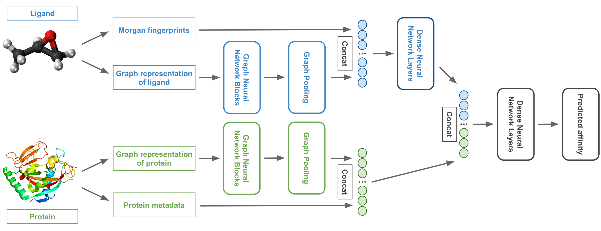

<h1 align="center">

 Drug-Target Affinity Prediction Using Graph Neural Networks and AlphaFold-Based Protein Structures</h1>

 ---

# Requirements
- python 3.7+  
# Usage
1. Clone the repository  
`git clone https://github.com/vtarasv/3d-prot-dta.git`  
2. Create and activate new python virtual environment  
3. Install requited packages  
`pip install -r 3d-prot-dta/requirements.txt`  
4. Run experiments  
`python 3d-prot-dta/test.py -b davis` for the Davis dataset  
`python 3d-prot-dta/test.py -b kiba` for the KIBA dataset  
The results will be saved in the `3d-prot-dta/results/`  
# Data
See the corresponding [README](data/README.md)
# Notes
- It is recommended to use GPU to speed up the experiments (machines with 1 GPU perform 20 times faster on average than machines with 4 CPUs)
- The code is tested on Ubuntu and Microsoft Windows operating systems
