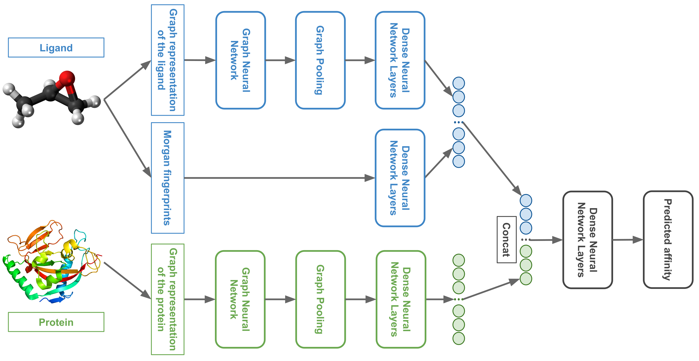

<h1 align="center">

 3DProtDTA: a deep learning model for drug-target affinity prediction based on residue-level protein graphs</h1>

 ---
# Article
https://doi.org/10.1039/D3RA00281K
# Requirements
- [Python](https://www.python.org/) >= 3.7  
- [PyTorch](https://pytorch.org/) >= 1.9  
- [PyTorch Geometric](https://pytorch-geometric.readthedocs.io/en/latest/) >= 2.0  
# Usage
1. Activate a python environment with PyTorch and PyTorch Geometric  
2. Clone the repository, navigate to the cloned folder  
`git clone https://github.com/vtarasv/3d-prot-dta.git`  
`cd 3d-prot-dta/`  
3. Install required packages  
`pip install wheel`  
`pip install -r requirements.txt`  
4. Run the experiments  
`python test.py` to obtain test datasets results as described in the manuscript  
`python test.py --datasets davis` to obtain only Davis test dataset results  
`python test.py --datasets kiba` to obtain only KIBA test dataset results  
The results will be saved in the `results/` folder  
The log will be saved in the `log/` folder  
5. You can also launch the tuning process in the same way as described in the manuscript  
`python tune.py --study my_study --sampler tpe`  
The tuning results will be saved in the local storage `sqlite:///dta_tune.db` (in the same folder)  
# Data
See the corresponding [README](data/README.md)
# Notes
- It is recommended to use GPU to speed up the experiments (machines with 1 GPU perform 20 times faster on average than machines with 4 CPUs)
- The training of 5 models (one per cross-validation train dataset) using one NVIDIA Tesla P100 SXM2 GPU takes about 10 and 40 hours for Davis and KIBA datasets respectively 
- The code is tested on Ubuntu operating system
